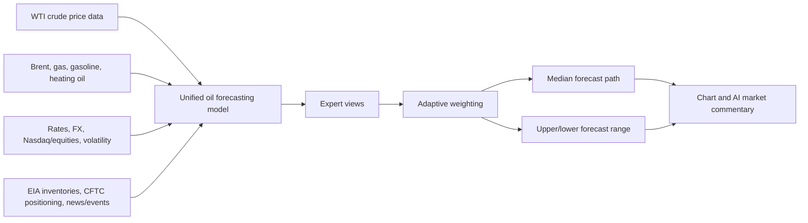

# Model Design

This document explains how the oil forecasting model reads market data, combines several expert views, and turns them into the final forecast path. Low-level implementation details are kept to the technical sections only.

The LLM does not directly forecast prices. It reads news/events, summarizes market context, and writes analyst-style explanations. Numeric forecasts are produced by the single operational oil model, `oil_context_fusion`.

## One-Line Summary

`oil_context_fusion` combines crude price action, related energy markets, rates/FX/equity context, oil inventories/positioning, and news tone. It blends several internal expert views, then produces the forecast path and forecast range.

## Data Flow



Every input must be point-in-time safe. EIA, CFTC, macro, and news/event values enter a sample only after they would have been available in real time.

## Internal Experts

The dashboard shows one model line, but the model internally blends seven expert views.

| Expert | Plain-English Role | Main Inputs |
| --- | --- | --- |
| Long-flow expert | Remembers ordered price history and longer context such as a rally followed by consolidation. | Longer price sequences |
| Shock/short-pattern expert | Captures recent jumps, pullbacks, and volatility shocks. | Short-term price changes |
| Important-window expert | Focuses more on the past windows that matter most for the current setup. | Key bars and turning points |
| News/macro context expert | Interprets news, events, inventories, rates, FX, and risk appetite together with price action. | News, macro, supply data |
| Pattern expert | Summarizes the current chart shape: trend, range position, momentum, and volatility. | Chart shape and trend |
| Motif expert | Searches for historical windows that resembled the recent market setup and uses them as analog hints. | Similar historical windows |
| Event-shock expert | Gives the model a dedicated view for geopolitical/supply shock setups where a normal p50 path tends to become too flat. | Event context and pattern summary |

## Pattern And Motif Experts

The pattern expert reads the current chart shape. It helps the model understand whether crude is pulling back from the upper range, rebounding from the lower range, consolidating inside an uptrend, or moving sideways without a clear breakout.

The motif expert looks for past periods that behaved like the recent market. It does not copy the past path directly; it uses similar historical windows as a statistical hint. This is useful in oil because inventory reports, geopolitical headlines, and OPEC comments can produce recurring market reactions.

These are not separate user-facing models anymore. They are internal experts inside `oil_context_fusion`.

## How The Final Forecast Is Built

1. Price and related-market data are converted into trend, volatility, relative strength, and shock signals.
2. Inventories, positioning, rates, FX, equities, and news context are aligned point-in-time.
3. Seven experts form their own view of the future path.
4. The adaptive weighting layer gives more weight to experts that fit the current regime.
5. The blended output becomes p05 through p95 quantile paths.
6. The default display line is the model's learned p50 path. The chart does not decorate the line with inference-time tail/hump post-processing.
7. The path is reconstructed back into price space and rendered on the chart.
8. AI market commentary explains the forecast using news and chart context.

## Inputs And Outputs

The names below are user-readable data groups rather than code variable names. Tensor sizes are the actual model sizes.

| Data Group | Size | Meaning |
| --- | --- | --- |
| Price data | `[batch, 128, 23]` | Crude price, volume, volatility, momentum, trend, and range position |
| Related-market data | `[batch, 128, 6]` | Brent, gas, gasoline, heating oil, dollar, rates, equities, and similar supporting signals |
| News/event data | `[batch, 27]` | 13 LLM context features plus 14 raw-news-pool features covering news volume, selection coverage, bullish/bearish pressure, energy/geopolitical/macro/supply/demand pressure, and source diversity |
| Current-state data | `[batch, 4]` | Current price, recent volatility, lookback length, and forecast length |
| Forecast range | `[batch, 30, 7]` | Lower, middle, and upper paths for up to 30 future steps. The UI displays the full 30-day path with 1-week, 2-week, and 1-month endpoints |
| Upside probability | `[batch, 30]` | Directional lean by future step |
| Expected volatility | `[batch, 30]` | Expected movement size by future step |
| Model confidence | `[batch, 1]` | Internal stability score for the current input state |

## Forecast Target

The model does not memorize raw future prices. It first learns how much price tends to move relative to recent volatility, then converts that movement back into price.

```text
volatility-adjusted future move = future cumulative log return / recent realized volatility
future price = current price * exp(predicted cumulative log return)
```

This makes learning more stable when the absolute oil price level changes.

After the 2026-06-05 update, training explicitly penalizes overly flat p50 paths. In addition to quantile pinball loss, the loss function optimizes step returns, detrended path shape, path range, step volatility, curvature, step direction, and auxiliary shock/range heads. The forecast target is still the volatility-scaled cumulative log-return path, and the price reconstruction formula is unchanged.

## Forecast Horizon Display

One model can vary forecast length, but only within a designed limit.

The current operating UI uses one 1D h30 artifact and displays the full 30-day path. The forecast-length selector was removed; the UI marks the 1-week, 2-week, and 1-month endpoints on the same h30 output. This avoids comparing different trained models or horizon artifacts on one screen.

The benefit is that every segment marker comes from the same model judgment. The 1-week, 2-week, and 1-month labels are endpoint markers on one p50 path, not separate forecast lines.

Longer than 30 steps should not be produced by repeatedly chaining the same model because errors compound quickly. If 60- or 90-step forecasts are needed, separate h60/h90 artifacts should be trained and evaluated.

## Current Coverage And Extension Strategy

The operating UI currently offers a fixed 1D/30-day view. 1H remains an API and research artifact target, while 15M/30M are excluded from the operating UI because the available history is short and news/supply release timestamps need stronger alignment before minute-level production use.

| Interval | UI Lengths | Model Artifact | Status |
| --- | --- | --- | --- |
| 1D | 30 days + 1W/2W/1M endpoints | h30 | Full path from the single operational artifact |
| 1H | API/research | h30 | Separate validation target |
| 30M | Excluded | Research candidate | Needs longer history and better news/supply timing |
| 15M | Excluded | Research candidate | Noisy and short-history; needs separate validation |

The practical extension order is:

1. Use 1D h30 as the main operational model.
2. Add 1H h30 as an hourly forecast only after separate validation.
3. Record SSE, MSE, RMSE, MAE, R2, MAPE, sMAPE, directional accuracy, step directional accuracy, range ratio, turn error, and shape score for every artifact.
4. Add calibration artifacts after enough rolling backtest origins exist.
5. Revisit 30M/15M only after data coverage and timestamp alignment are improved.

## 2026-06-05 Retraining Status

The currently stabilized operational artifact is the CL=F-only `oil_context_fusion_1d_h30`. News now combines Google News RSS backfill and public RSS sources aligned to the price-data range, and event context is encoded with the external Google Generative LLM. After the final retry pass, `External LLM fallback` rows are zero. On 2026-06-05, the event/context input was expanded to 27 dimensions by adding 14 aggregate features from the full point-in-time raw-news pool so the bounded latest-news set read directly by the LLM does not become a model-input bottleneck.

| Model | Training Mode | Train/Val/Test | Key Performance |
| --- | --- | ---: | --- |
| `oil_context_fusion_1d_h30` | chronological holdout | 1,651 / 353 / 353 | validation MAPE 5.45%, test MAPE 6.93%. validation/test RMSE 5.42/8.02, range ratio 1.32/1.26, shape score 90.5/87.6 |

This artifact is intentionally saved from a chronological holdout run instead of a final-fit-all-data run, so overfitting can be checked. Metadata records the full sample range (`sample_start=2016-12-07`, `sample_end=2026-04-23`) separately from the actual train cutoff (`train_end=2023-07-03`, `training_cutoff=2023-07-03`).

On 2026-06-05, the dashboard revealed that the deep p50 path was repeating a horizon-average template more strongly than the origin-specific inputs. The 1D display path now uses a point-in-time path adapter. The adapter does not look at future prices; it only uses price state and event/context vectors available at the origin.

- Normal regime: blends half of the `pattern_mlp` residual shape to reduce the deep model's fixed horizon template.
- Geopolitical supply shock: when war, attacks, sanctions, or Hormuz/Red Sea supply-disruption headlines are strong, the adapter can open an upside supply-risk-premium path even if the aggregate bias is mixed or neutral.
- Bullish geopolitical breakout: uses the LLM/event encoder direction score, raw-news bullish/geopolitical pressure, recent momentum, and RSI to form a fast upside shock path.
- Event risk premium: when the LLM direction score flickers for a day but the raw-news pool still shows persistent bullish/geopolitical/energy pressure, the adapter continuously adds an upside risk premium. This avoids a hard-threshold drop from an upside event path into a flat path. To avoid monotonic straight-line paths, the event signal sets the terminal direction and level while the high/low residual shape comes from the model, motif, or recent historical path.
- Overextended mean reversion: uses recent 30/60-day surge, RSI, and proximity to the 20-day high to form an early-drop then recovery path.

This adapter does not use the LLM as a numeric price forecaster. The LLM remains only the context/event encoder, and numeric prices are still restored from a volatility-scaled cumulative log-return path. When the adapter is active, `deep_model_info.oil_context_fusion.path_adapter` records the adapter type, supply-shock score, and event/context inputs so the explanation API can describe why the path leaned in that direction.

## Training Losses And Evaluation Metrics

MAPE is useful for reporting on the screen, but it is not strong enough as the training loss. It is sensitive to price level and does not sufficiently punish path shape failures or tail events. The current deep loss optimizes these terms together:

- Quantile pinball loss: learns p05-p95 distribution paths.
- Median Huber loss: reduces robust median-path error.
- Step-return loss: forces day-to-day changes to matter, not only the cumulative path.
- Terminal loss: checks the final cumulative direction.
- Path shape/range/step-volatility/curvature loss: discourages flattening peaks, troughs, path amplitude, curvature, and volatility.
- Step direction and direction-head loss: learns step direction and the upside-probability head.
- Shock/range auxiliary loss: gives shock regimes and large path-range cases dedicated supervision.
- Gaussian tail path loss: strongly penalizes large cumulative-path errors outside the normal-distribution tail.
- Range shortfall tail loss: applies an exponential tail penalty when the realized path has a large range but the prediction is flat.

Operational evaluation should therefore not rely on MAPE alone. RMSE/MAE, sMAPE, step directional accuracy, range ratio, turn error, and shape score are tracked together. A screenshot-like case where the realized path surges but the forecast stays flat receives a large loss from the new tail and range-shortfall terms.

## Training Command

1D h30 operational artifact example:

```bash
.venv/bin/python scripts/train/train_deep_fusion_models.py \
  --model oil_context_fusion \
  --interval 1d \
  --horizon 30 \
  --lookback 128 \
  --symbols CL=F \
  --use-processed-data \
  --market-panel data/processed/market_panel/1d/panel.csv \
  --oil-fundamentals data/processed/oil_fundamentals/eia_weekly.csv \
  --cot data/processed/oil_fundamentals/cftc_cot_weekly.csv \
  --macro-panel data/processed/macro_panel/fred_daily_wide.csv \
  --event-context data/processed/event_context/event_context_daily.csv \
  --max-samples 0 \
  --epochs 28 \
  --batch-size 64 \
  --learning-rate 0.0007 \
  --patience 8 \
  --device mps \
  --force \
  --llm-context \
  --progress-every-batches 20
```

For a final deployable all-data artifact, first record and keep a separate holdout evaluation, then add `--fit-final-all-data`.

For other intervals, change `--interval`, `--horizon`, `--lookback`, and `--market-panel` to the target interval while keeping the same model structure.

## Artifacts And Metadata

- Model artifacts: `artifacts/models`
- Metadata JSON: `artifacts/metadata`
- Smoke artifacts: `artifacts/smoke`

Metadata records model name, interval, horizon, sample range, actual train cutoff, input data paths, expert list, SSE/MSE/RMSE/MAE/R2/MAPE/sMAPE/directional accuracy/range ratio/shape score.

## Removed Or Internalized Models

- `lstm`, `tcn`: no longer standalone operational models; they are internal experts.
- `motif`, `pattern_mlp`: no longer user-facing model choices; they are internal experts.
- `cycle`: more useful as a feature than as a standalone extrapolator.
- `ensemble`: fixed weighting was replaced by learned adaptive weighting.
