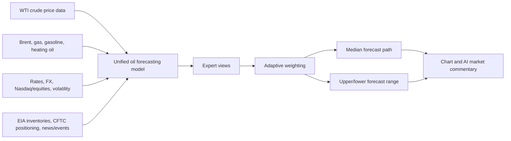

# Model Design

This document explains how the oil forecasting model reads market data, combines several expert views, and turns them into the final forecast path. Low-level implementation details are kept to the technical sections only.

The LLM does not directly forecast prices. It reads news/events, summarizes market context, and writes analyst-style explanations. Numeric forecasts are produced by the single operational oil model, `oil_context_fusion`.

## One-Line Summary

`oil_context_fusion` combines crude price action, related energy markets, rates/FX/equity context, oil inventories/positioning, and news tone. It blends several internal expert views, then produces the forecast path and forecast range.

## Data Flow



Every input must be point-in-time safe. EIA, CFTC, macro, and news/event values enter a sample only after they would have been available in real time.

## Internal Experts

The dashboard shows one model line, but the model internally blends six expert views.

| Expert | Plain-English Role | Main Inputs |
| --- | --- | --- |
| Long-flow expert | Remembers ordered price history and longer context such as a rally followed by consolidation. | Longer price sequences |
| Shock/short-pattern expert | Captures recent jumps, pullbacks, and volatility shocks. | Short-term price changes |
| Important-window expert | Focuses more on the past windows that matter most for the current setup. | Key bars and turning points |
| News/macro context expert | Interprets news, events, inventories, rates, FX, and risk appetite together with price action. | News, macro, supply data |
| Pattern expert | Summarizes the current chart shape: trend, range position, momentum, and volatility. | Chart shape and trend |
| Motif expert | Searches for historical windows that resembled the recent market setup and uses them as analog hints. | Similar historical windows |

## Pattern And Motif Experts

The pattern expert reads the current chart shape. It helps the model understand whether crude is pulling back from the upper range, rebounding from the lower range, consolidating inside an uptrend, or moving sideways without a clear breakout.

The motif expert looks for past periods that behaved like the recent market. It does not copy the past path directly; it uses similar historical windows as a statistical hint. This is useful in oil because inventory reports, geopolitical headlines, and OPEC comments can produce recurring market reactions.

These are not separate user-facing models anymore. They are internal experts inside `oil_context_fusion`.

## How The Final Forecast Is Built

1. Price and related-market data are converted into trend, volatility, relative strength, and shock signals.
2. Inventories, positioning, rates, FX, equities, and news context are aligned point-in-time.
3. Six experts form their own view of the future path.
4. The adaptive weighting layer gives more weight to experts that fit the current regime.
5. The blended output becomes the median path and upper/lower range.
6. The path is reconstructed back into price space and rendered on the chart.
7. AI market commentary explains the forecast using news and chart context.

## Inputs And Outputs

The names below are user-readable data groups rather than code variable names. Tensor sizes are the actual model sizes.

| Data Group | Size | Meaning |
| --- | --- | --- |
| Price data | `[batch, 128, 23]` | Crude price, volume, volatility, momentum, trend, and range position |
| Related-market data | `[batch, 128, 6]` | Brent, gas, gasoline, heating oil, dollar, rates, equities, and similar supporting signals |
| News/event data | `[batch, 13]` | News/event tone summarized into pressure, importance, uncertainty, and related context |
| Current-state data | `[batch, 4]` | Current price, recent volatility, lookback length, and forecast length |
| Forecast range | `[batch, 30, 7]` | Lower, middle, and upper paths for up to 30 future steps. The UI displays the selected 7, 14, or 30 leading steps |
| Upside probability | `[batch, 30]` | Directional lean by future step |
| Expected volatility | `[batch, 30]` | Expected movement size by future step |
| Model confidence | `[batch, 1]` | Internal stability score for the current input state |

## Forecast Target

The model does not memorize raw future prices. It first learns how much price tends to move relative to recent volatility, then converts that movement back into price.

```text
volatility-adjusted future move = future cumulative log return / recent realized volatility
future price = current price * exp(predicted cumulative log return)
```

This makes learning more stable when the absolute oil price level changes.

## How Forecast Length Changes

One model can vary forecast length, but only within a designed limit.

The current design trains one h30 artifact per interval. When the user selects 7 or 14, the backend runs the same 30-step path and returns the leading segment. For example, 1D with length 7 displays the first 7 days from the 30-day path, and 1H with length 14 displays the first 14 hours from the 30-hour path.

This keeps 7/14/30 views consistent because they come from the same forecast path rather than separate models. Technically the backend can display any length from 1 to 30, but the UI offers 7, 14, and 30 because those are easier choices for users.

Longer than 30 steps should not be produced by repeatedly chaining the same model because errors compound quickly. If 60- or 90-step forecasts are needed, separate h60/h90 artifacts should be trained and evaluated.

## Current Coverage And Extension Strategy

The operating UI offers only 1D and 1H. 15M/30M are not merely hidden; they are kept as research candidates because the available history is short and news/supply release timestamps need stronger alignment before minute-level production use.

| Interval | UI Lengths | Model Artifact | Status |
| --- | --- | --- | --- |
| 1D | 7, 14, 30 | h30 | Production artifact exists |
| 1H | 7, 14, 30 | h30 | Production artifact exists |
| 30M | Excluded | Research candidate | Needs longer history and better news/supply timing |
| 15M | Excluded | Research candidate | Noisy and short-history; needs separate validation |

The practical extension order is:

1. Use 1D h30 as the main operational model.
2. Train 1H h30 to add hourly forecasts.
3. Record SSE, MSE, RMSE, MAE, R2, MAPE, sMAPE, and directional accuracy for every artifact.
4. Add calibration artifacts after enough rolling backtest origins exist.
5. Revisit 30M/15M only after data coverage and timestamp alignment are improved.

## 2026-06-02 Retraining Status

The current operational model uses five energy futures (`CL=F`, `BZ=F`, `NG=F`, `RB=F`, `HO=F`) plus EIA/CFTC/FRED/news data.

| Model | Train/Val/Test | Validation Loss | Epochs | Validation RMSE/MAE/MAPE/R2 | Test RMSE/MAE/MAPE/sMAPE/R2/Dir |
| --- | --- | --- | --- | --- | --- |
| `oil_context_fusion` h8 | 8,330 / 1,784 / 1,784 | 1.268454 | 5 | 1.8478 / 0.9604 / 3.7870 / 0.9976 | 2.8005 / 1.1839 / 4.5385 / 4.5023 / 0.9933 / 0.5081 |
| `oil_context_fusion` 1D h30 | 8,252 / 1,768 / 1,768 | 2.280637 | 3 | 3.1088 / 1.6629 / 6.7388 / 0.9933 | 3.5934 / 1.7190 / 7.3365 / 7.2447 / 0.9882 / 0.5121 |
| `oil_context_fusion` 1H h30 | 45,962 / 9,849 / 9,849 | 2.116694 | 4 | 0.4963 / 0.2618 / 1.2760 / 0.9997 | 2.1368 / 0.8477 / 2.4915 / 2.4764 / 0.9971 / 0.5176 |
| `oil_context_fusion` h45 | 8,201 / 1,756 / 1,756 | 2.738672 | 5 | 3.7215 / 1.9963 / 8.2020 / 0.9905 | 3.9224 / 1.9581 / 8.4560 / 8.3556 / 0.9853 / 0.5115 |

h8/h45 are previous experiments. The operating UI now uses the h30 artifact and displays 7/14/30 leading lengths.

## Training Command

1D h30 example:

```bash
.venv/bin/python scripts/train/train_deep_fusion_models.py \
  --model oil_context_fusion \
  --interval 1d \
  --horizon 30 \
  --lookback 128 \
  --universe oil_core \
  --llm-context \
  --event-context data/processed/event_context/event_context_daily.csv \
  --use-processed-data \
  --market-panel data/processed/market_panel/1d/panel.csv \
  --oil-fundamentals data/processed/oil_fundamentals/eia_weekly.csv \
  --cot data/processed/oil_fundamentals/cftc_cot_weekly.csv \
  --macro-panel data/processed/macro_panel/fred_daily_wide.csv \
  --max-samples 0 \
  --epochs 5 \
  --patience 2 \
  --batch-size 64 \
  --device mps \
  --force
```

For other intervals, change `--interval`, `--horizon`, `--lookback`, and `--market-panel` to the target interval while keeping the same model structure.

## Artifacts And Metadata

- Model artifacts: `artifacts/models`
- Metadata JSON: `artifacts/metadata`
- Smoke artifacts: `artifacts/smoke`

Metadata records model name, interval, horizon, training window, input data paths, expert list, SSE/MSE/RMSE/MAE/R2/MAPE/sMAPE, and directional accuracy.

## Removed Or Internalized Models

- `lstm`, `tcn`: no longer standalone operational models; they are internal experts.
- `motif`, `pattern_mlp`: no longer user-facing model choices; they are internal experts.
- `cycle`: more useful as a feature than as a standalone extrapolator.
- `ensemble`: fixed weighting was replaced by learned adaptive weighting.
