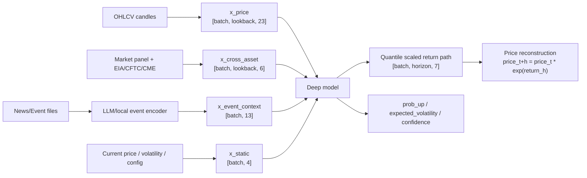
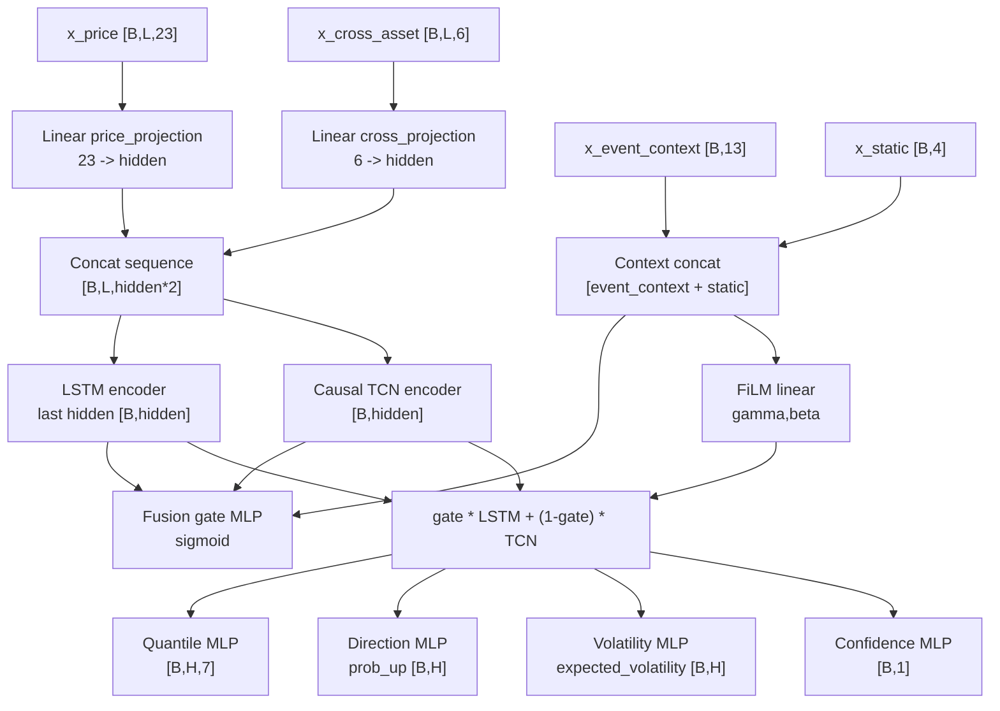
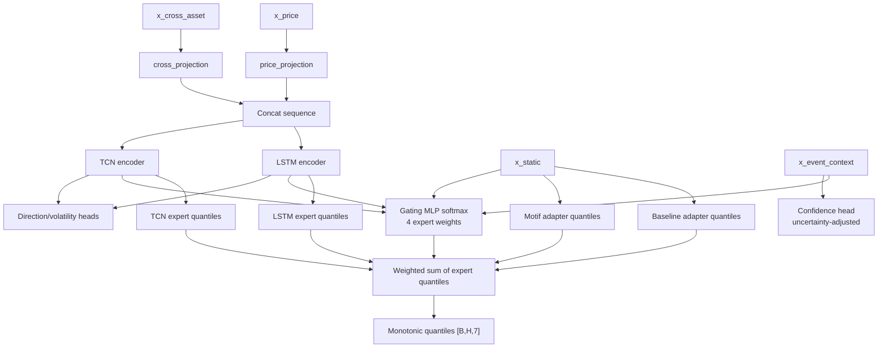

# Model Design

Numeric forecasts are handled by time-series models and baselines. The LLM is a context/event encoder and explanation generator, not a direct price forecaster.

## Model Taxonomy

| Class | Models |
| --- | --- |
| Classical | `motif` |
| Deep learning | `pattern_mlp`, `deep_lstm_tcn_fusion`, `llm_context_seq_moe` |
| Baseline | `random_walk`, `drift`, `seasonal_naive`, `volatility_scaled_naive` |
| Backtest-only | `flat`, `simple_moving_average_path`, optional `regime_ensemble` |
| Removed/deprecated | `cycle`, `lstm`, `tcn`, `ensemble` |

## Forecast Target

The forecast target is a volatility-scaled cumulative log return distribution. Raw future price is not used directly as the training target.

```text
scaled_target_h = cumulative_log_return_h / recent_realized_volatility
price_t+h = current_price * exp(predicted_cumulative_log_return_h)
```

This structure allows the same model/feature design to extend across assets with different price levels.

## Input Features

| Input | Contents |
| --- | --- |
| `x_price` | log returns, vol-scaled returns, range, rolling volatility, momentum, drawdown, autocorrelation, trend, skew/kurtosis, cycle features |
| `x_cross_asset` | related returns, correlation, spread, relative strength, risk proxy, missing indicators |
| `x_event_context` | event/context vectors from local_rules or LLM encoders |
| `x_static` | current price, realized volatility, lookback, horizon |

EIA/CFTC/CME/event context values enter samples only when `feature_available_at <= as_of_time`.

## Input And Output Tensor Structure

For the current `1d`, `horizon=8`, `lookback=128` artifacts, the deep model tensors are:

| Tensor | Shape | Meaning |
| --- | --- | --- |
| `x_price` | `[batch, 128, 23]` | Price, volatility, trend, and distribution features from each asset's OHLCV |
| `x_cross_asset` | `[batch, 128, 6]` | Related asset returns/correlation plus EIA/CFTC/CME-derived proxies and missing indicators |
| `x_event_context` | `[batch, 13]` | News/event context vector from the LLM or deterministic local rules |
| `x_static` | `[batch, 4]` | Current price, recent realized volatility, lookback, and horizon |
| `quantiles` | `[batch, 8, 7]` | 5/10/25/50/75/90/95% volatility-scaled cumulative log return |
| `prob_up` | `[batch, 8]` | Up-direction probability by horizon step |
| `expected_volatility` | `[batch, 8]` | Expected volatility by step |
| `confidence` | `[batch, 1]` | Internal model confidence score |

The forecast price path is reconstructed from scaled cumulative log returns:

```text
predicted_cumulative_log_return_h = predicted_scaled_return_h * recent_realized_volatility
predicted_price_t+h = current_price * exp(predicted_cumulative_log_return_h)
```

The current training script instantiates artifacts with these architecture defaults:

| Item | Current Value |
| --- | --- |
| `hidden_dim` | 48 |
| `dropout` | 0.1 |
| Quantile levels | 0.05, 0.10, 0.25, 0.50, 0.75, 0.90, 0.95 |
| LSTM | 1-layer, unidirectional `nn.LSTM(input_size=96, hidden_size=48, batch_first=True)` |
| TCN | `Linear(96 -> 48)`, then dilation 1/2/4/8 causal residual blocks |
| TCN block | `CausalConv1d(48 -> 48, kernel=3, dilation=d)` x 2, `GELU`, `Dropout(0.1)`, residual `LayerNorm(48)` |
| Shared MLP | `Linear(input -> 48)`, `GELU`, `Dropout(0.1)`, `Linear(48 -> output)` |

## Full Deep Forecast Flow



## DeepLstmTcnFusion

`deep_lstm_tcn_fusion` projects price features and optional cross-asset features, then runs causal LSTM and causal TCN encoders in parallel. The fusion gate mixes both encoders using LSTM/TCN representations, event context, and static features.



Outputs:

- volatility-scaled cumulative log return quantiles
- `prob_up`
- expected volatility
- confidence

Layer structure:

| Stage | Structure |
| --- | --- |
| Projection | `x_price: 23 -> 48`, `x_cross_asset: 6 -> 48` |
| Sequence concat | `[B,128,48] + [B,128,48] -> [B,128,96]` |
| LSTM encoder | `[B,128,96] -> last hidden [B,48]` |
| TCN encoder | `[B,128,96] -> [B,48]`, dilation 1/2/4/8 causal residual stack |
| Context conditioning | `x_event_context [B,13] + x_static [B,4] -> context [B,17]` |
| Fusion gate | `MLP(48 + 48 + 17 -> 48)`, sigmoid, then `gate * LSTM + (1-gate) * TCN` |
| FiLM | `Linear(17 -> 96)` split into `gamma [B,48]` and `beta [B,48]` to modulate the fused representation |
| Heads | Quantile `MLP(48 -> 56)` reshaped to `[B,8,7]`, direction `MLP(48 -> 8)`, volatility `MLP(48 -> 8)`, confidence `MLP(48+17 -> 1)` |

## LLMContextSeqMoE

`llm_context_seq_moe` is a learned mixture-of-experts with an LSTM expert, TCN expert, baseline adapter, and motif adapter.



What LLM/event context does:

- provides context to the gating network
- helps adjust uncertainty/confidence
- adds regime/event state as auxiliary features

What LLM/event context does not do:

- directly generate price paths
- directly generate p50/p90
- overwrite time-series model outputs

Layer structure:

| Stage | Structure |
| --- | --- |
| Shared projection | `x_price: 23 -> 48`, `x_cross_asset: 6 -> 48`, concatenated to `[B,128,96]` |
| Shared sequence encoder | LSTM last hidden `[B,48]`, TCN representation `[B,48]` |
| Expert heads | LSTM expert `MLP(48 -> 56)`, TCN expert `MLP(48 -> 56)`, baseline adapter `MLP(4 -> 56)`, motif adapter `MLP(4 -> 56)` |
| Gating network | `x_event_context [B,13] + x_static [B,4] + LSTM [B,48] + TCN [B,48] -> MLP(113 -> 4)`, softmax expert weights |
| Mixture | Four expert paths `[B,8,7]` are weighted by the softmax outputs, then quantile monotonicity is enforced with `sort` |
| Auxiliary heads | Direction/volatility use `MLP(48+48+4 -> 8)`, confidence uses `MLP(13+4 -> 1)` and is reduced by event uncertainty |

## Framework Decision

The current deep learning code already uses PyTorch.

- Models inherit from `torch.nn.Module`.
- LSTM layers use `torch.nn.LSTM`.
- Training uses `torch.utils.data.DataLoader`, `torch.optim.AdamW`, and gradient clipping.
- Use `--device mps` on Apple Silicon and `--device cuda` on NVIDIA systems for acceleration.

A direct rewrite to TensorFlow/Keras is unlikely to make this project faster. The current bottlenecks are not framework overhead; they are:

- LLM event-context generation speed and API quota
- short news history
- repeated deep inference dataset construction during walk-forward backtests
- weak predictive signal relative to simple baselines

The higher-impact improvements are LLM context cache/resume, longer historical news coverage, backtest inference caching, and stricter time-split/coverage evaluation.

## Quantiles And Calibration

Quantile paths must be monotonic. Rolling backtest residuals can produce calibration artifacts.

```text
artifacts/calibration/{model}_{symbol}_{interval}.json
```

Until calibration artifacts are sufficiently validated, probabilistic bands are residual-volatility adapters, not validated confidence intervals.

## Artifacts And Metadata

- `.npz` legacy/global artifacts: `artifacts/models`
- `.pt` deep artifacts: `artifacts/models`
- metadata JSON: `artifacts/metadata`

Metadata should include at least model id, interval, horizon, lookback, training window, train/validation loss, feature sources, and a data hash or manifest reference.

## Currently Trainable Setup

The current processed data supports this setup:

```bash
.venv/bin/python scripts/train/train_deep_fusion_models.py \
  --model both \
  --interval 1d \
  --horizon 8 \
  --lookback 128 \
  --universe research_core \
  --use-processed-data \
  --market-panel data/processed/market_panel/1d/panel.csv \
  --oil-fundamentals data/processed/oil_fundamentals/eia_weekly.csv \
  --cot data/processed/oil_fundamentals/cftc_cot_weekly.csv \
  --event-context data/processed/event_context/event_context_daily.csv \
  --max-samples 512 \
  --epochs 3 \
  --batch-size 64 \
  --device mps \
  --force
```

`horizon=45` is also possible, but LLM context impact should be interpreted cautiously if news/event context history is short.

## Why Models Were Removed

- `lstm`/`tcn`: live cached training made reproducibility and operations weak.
- `cycle`: cycle phase/strength is more useful as a feature than as standalone extrapolation.
- `ensemble`: fixed-weight mixes cannot learn regime/context behavior, so they were replaced by learned MoE.
