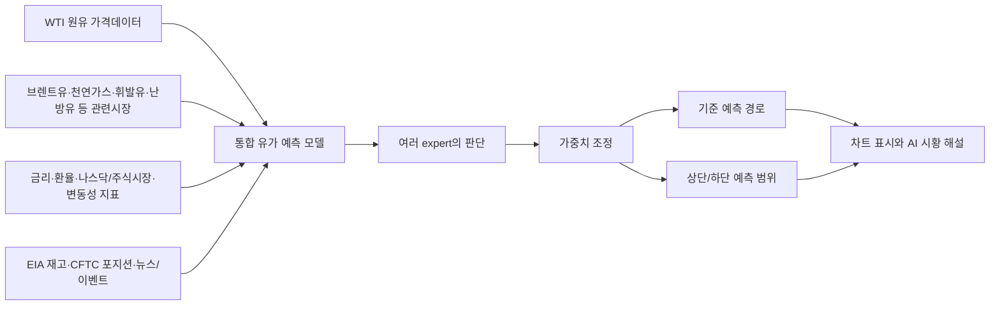

# 모델 설계

이 문서는 일반 사용자가 “유가 예측 모델이 어떤 자료를 보고, 어떤 방식으로 판단하고, 최종 예측값을 어떻게 만드는지” 이해할 수 있도록 설명합니다. 자세한 코드 구현은 뒤쪽 기술 부록에만 남깁니다.

LLM은 가격을 직접 찍어내는 예측기가 아닙니다. 뉴스와 이벤트를 읽어 시장 분위기를 정리하고, 최종 화면에서는 애널리스트식 해설을 만드는 역할만 합니다. 숫자 예측은 `oil_context_fusion`이라는 단일 통합 유가 예측 모델이 담당합니다.

## 한 줄 요약

`oil_context_fusion`은 가격 흐름, 관련 에너지 시장, 금리/환율/주식시장, 원유 재고와 포지션, 뉴스 분위기를 함께 보고 여러 관점의 expert 판단을 합친 뒤 미래 유가 경로와 범위를 계산합니다.

## 전체 데이터 흐름



데이터는 항상 “그 시점에 이미 알 수 있었던 정보”만 사용합니다. 예를 들어 EIA 재고나 CFTC 포지션은 발표일 이후에만 학습 샘플에 들어갑니다. 이 원칙은 백테스트에서 미래 정보를 몰래 보는 문제를 막기 위해 중요합니다.

## 모델을 구성하는 expert들

통합 모델은 하나의 모델이지만 내부에는 여섯 가지 관점이 있습니다. 화면에는 하나의 예측선만 나오지만, 내부에서는 아래 expert들의 판단을 상황에 맞게 섞습니다.

| Expert | 쉬운 설명 | 주로 보는 것 |
| --- | --- | --- |
| 장기 흐름 expert | 과거 가격 흐름의 순서와 누적된 방향성을 기억합니다. 급등 후 조정, 긴 횡보 후 돌파 같은 긴 맥락을 봅니다. | 긴 가격 흐름 |
| 충격/단기 패턴 expert | 최근 며칠 또는 몇 시간 동안의 빠른 변화와 변동성 충격을 잘 잡습니다. | 단기 가격 변화, 급등락 |
| 중요 구간 집중 expert | 모든 과거 구간을 똑같이 보지 않고, 현재 판단에 중요한 시점을 더 강하게 봅니다. | 중요한 봉, 전환점 |
| 뉴스/거시 맥락 expert | 뉴스, 이벤트, 재고, 금리, 환율, 위험선호 분위기를 가격 흐름과 함께 해석합니다. | 뉴스데이터, 경제지표, 수급 자료 |
| 패턴 expert | 최근 흐름의 평균, 변동성, 추세, 고점/저점 위치를 요약해 “지금 차트 모양이 어떤 상태인지” 판단합니다. | 차트 모양, 추세, 변동성 |
| 모티프 expert | 최근 움직임과 비슷했던 과거 구간을 찾아 당시 이후의 흐름을 참고합니다. 단순 복사는 아니고, 비슷한 장면들의 평균적인 힌트를 가져옵니다. | 과거 유사 구간 |

## 패턴 모델과 모티프 모델

패턴 모델은 차트의 현재 모양을 요약하는 역할입니다. 예를 들어 “고점권에서 밀리고 있는지”, “저점권에서 반등하는지”, “상승 추세가 잠시 쉬는지”, “박스권에 갇혀 있는지” 같은 정보를 숫자로 정리합니다. 이 expert는 모델이 최근 가격의 모양을 빠르게 읽도록 돕습니다.

모티프 모델은 “지금과 비슷했던 과거 장면”을 찾습니다. 최근 일정 구간의 움직임을 과거 여러 구간과 비교하고, 가장 비슷한 과거 구간들이 이후에 어떤 방향으로 움직였는지 참고합니다. 원유는 재고 발표, 지정학 뉴스, OPEC 발언 뒤에 비슷한 반복 패턴이 나타나는 경우가 있기 때문에 이 관점이 도움이 됩니다.

두 모델은 더 이상 사용자에게 따로 노출되는 별도 예측 모델이 아닙니다. 지금은 `oil_context_fusion` 내부 expert로 들어가 최종 예측을 보조합니다.

## 최종 예측값이 만들어지는 방식

1. 가격데이터와 관련시장데이터에서 추세, 변동성, 상대 강도, 최근 충격을 계산합니다.
2. 원유 재고, 포지션, 금리, 환율, 주식시장, 뉴스데이터를 시점에 맞게 붙입니다.
3. 여섯 expert가 각자 미래 경로에 대한 판단을 만듭니다.
4. 가중치 조정 장치가 현재 국면에 더 맞는 expert에 더 큰 비중을 줍니다.
5. 여러 expert의 결과를 합쳐 기준 예측선과 상단/하단 범위를 만듭니다.
6. 현재 가격에서 미래 가격으로 복원해 차트에 표시합니다.
7. AI 시황 해설은 이 결과와 뉴스/차트 맥락을 바탕으로 “왜 그런 방향으로 보는지” 설명합니다.

## 입력과 출력

아래 표의 이름은 코드 변수명이 아니라 사용자가 이해하기 쉬운 데이터 묶음 이름입니다. 크기는 실제 모델에 들어가는 텐서 크기입니다.

| 데이터 묶음 | 크기 | 의미 |
| --- | --- | --- |
| 가격데이터 | `[batch, 128, 23]` | 원유 자체 가격, 거래량, 변동성, 모멘텀, 추세, 고점/저점 위치 |
| 관련시장데이터 | `[batch, 128, 6]` | 브렌트유, 천연가스, 휘발유, 난방유, 달러, 금리, 주식시장 등에서 만든 보조 정보 |
| 뉴스/이벤트데이터 | `[batch, 13]` | 뉴스와 이벤트를 상승/하락 압력, 중요도, 불확실성 등으로 요약한 값 |
| 현재상태데이터 | `[batch, 4]` | 현재 가격, 최근 변동성, 모델이 보는 과거 길이, 예측 길이 |
| 예측범위 | `[batch, 30, 7]` | 최대 30스텝까지의 하단/중앙/상단 경로. 화면에서는 7, 14, 30 중 선택한 길이만 표시 |
| 상승가능성 | `[batch, 30]` | 각 미래 시점에서 상승 쪽으로 기울 가능성 |
| 예상변동성 | `[batch, 30]` | 각 미래 시점에서 흔들릴 수 있는 정도 |
| 모델신뢰도 | `[batch, 1]` | 현재 입력 상태에서 모델이 스스로 평가한 안정성 점수 |

## 예측 대상

모델은 미래 가격을 그대로 외우거나 직접 맞히지 않습니다. 먼저 “현재 가격 대비 얼마나 움직일지”를 학습한 뒤, 마지막에 다시 가격으로 바꿉니다.

```text
변동성으로 조정한 미래 움직임 = 미래 누적 로그수익률 / 최근 실현변동성
미래 가격 = 현재 가격 * exp(예측 누적 로그수익률)
```

이 구조를 쓰면 가격대가 바뀌어도 모델이 “움직임의 크기”를 비교적 안정적으로 배울 수 있습니다.

## 예측 기간을 바꾸는 방식

모델 하나로 예측 기간을 마음대로 늘렸다 줄이는 것은 구조적으로 “일부는 가능하고, 일부는 위험합니다.”

현재 채택한 방식은 주기별로 최대 30스텝을 한 번에 예측하는 h30 모델을 만들고, 사용자가 7 또는 14를 선택하면 그 앞부분만 잘라 보여주는 방식입니다. 예를 들어 1D에서 7을 고르면 같은 30일 경로의 첫 7일만 표시하고, 1H에서 14를 고르면 같은 30시간 경로의 첫 14시간만 표시합니다.

이 방식의 장점은 7/14/30이 서로 다른 모델이 아니라 같은 판단에서 나온 경로라는 점입니다. 따라서 사용자가 기간을 바꿔도 방향성이 갑자기 바뀌는 문제가 줄어듭니다. 기술적으로는 1부터 30 사이의 어떤 길이도 잘라 보여줄 수 있지만, UI에서는 사용자가 이해하기 쉬운 7, 14, 30만 제공합니다.

30보다 더 긴 기간은 같은 모델을 반복 호출해 억지로 이어 붙일 수는 있지만 오차가 빠르게 누적됩니다. 그래서 60일, 90일 같은 장기 기간이 필요하면 h60, h90 artifact를 별도로 학습하는 편이 더 안전합니다.

## 현재 작동 범위와 확장 전략

운영 UI는 1D와 1H만 제공합니다. 15M/30M은 단순히 숨긴 것이 아니라, 현재 데이터 기간이 짧고 뉴스/수급 자료의 발표 시각을 분봉에 정확히 맞추는 품질이 아직 부족하다고 판단했습니다. 먼저 1D와 1H의 h30 모델을 안정화한 뒤, 분봉은 별도 연구 항목으로 남깁니다.

| 주기 | 화면 선택 기간 | 모델 artifact | 상태 |
| --- | --- | --- | --- |
| 1D | 7, 14, 30 | h30 | 운영 artifact 있음 |
| 1H | 7, 14, 30 | h30 | 운영 artifact 있음 |
| 30M | 제외 | 연구 대상 | 데이터 기간과 뉴스/수급 정렬 보강 필요 |
| 15M | 제외 | 연구 대상 | 노이즈가 크고 학습 기간이 짧아 별도 검증 필요 |

확장 순서는 다음이 합리적입니다.

1. 1D h30을 기준 운영 모델로 둡니다.
2. 1H h30을 학습해 시간 단위 예측을 추가합니다.
3. 각 artifact마다 SSE, MSE, RMSE, MAE, R2, MAPE, sMAPE, 방향정확도를 기록하고 1D와 1H를 따로 비교합니다.
4. 충분한 백테스트가 쌓이면 예측 범위 보정 artifact를 별도로 만듭니다.
5. 이후 30M/15M은 발표 시각 정렬과 데이터 기간 문제가 해결된 뒤 검토합니다.

## 2026-06-02 재학습 상태

현재 운영 모델은 5개 에너지 선물(`CL=F`, `BZ=F`, `NG=F`, `RB=F`, `HO=F`)과 EIA/CFTC/FRED/뉴스 데이터를 사용해 학습합니다.

| 모델 | Train/Val/Test | Validation loss | Epochs | Validation RMSE/MAE/MAPE/R2 | Test RMSE/MAE/MAPE/sMAPE/R2/Dir |
| --- | --- | --- | --- | --- | --- |
| `oil_context_fusion` h8 | 8,330 / 1,784 / 1,784 | 1.268454 | 5 | 1.8478 / 0.9604 / 3.7870 / 0.9976 | 2.8005 / 1.1839 / 4.5385 / 4.5023 / 0.9933 / 0.5081 |
| `oil_context_fusion` 1D h30 | 8,252 / 1,768 / 1,768 | 2.280637 | 3 | 3.1088 / 1.6629 / 6.7388 / 0.9933 | 3.5934 / 1.7190 / 7.3365 / 7.2447 / 0.9882 / 0.5121 |
| `oil_context_fusion` 1H h30 | 45,962 / 9,849 / 9,849 | 2.116694 | 4 | 0.4963 / 0.2618 / 1.2760 / 0.9997 | 2.1368 / 0.8477 / 2.4915 / 2.4764 / 0.9971 / 0.5176 |
| `oil_context_fusion` h45 | 8,201 / 1,756 / 1,756 | 2.738672 | 5 | 3.7215 / 1.9963 / 8.2020 / 0.9905 | 3.9224 / 1.9581 / 8.4560 / 8.3556 / 0.9853 / 0.5115 |

h8/h45는 이전 실험 결과이고, 운영 UI는 h30 artifact를 기준으로 7/14/30 표시 길이를 제공합니다.

## 학습 명령

1D h30 예시:

```bash
.venv/bin/python scripts/train/train_deep_fusion_models.py \
  --model oil_context_fusion \
  --interval 1d \
  --horizon 30 \
  --lookback 128 \
  --universe oil_core \
  --llm-context \
  --event-context data/processed/event_context/event_context_daily.csv \
  --use-processed-data \
  --market-panel data/processed/market_panel/1d/panel.csv \
  --oil-fundamentals data/processed/oil_fundamentals/eia_weekly.csv \
  --cot data/processed/oil_fundamentals/cftc_cot_weekly.csv \
  --macro-panel data/processed/macro_panel/fred_daily_wide.csv \
  --max-samples 0 \
  --epochs 5 \
  --patience 2 \
  --batch-size 64 \
  --device mps \
  --force
```

다른 시간봉은 `--interval`, `--horizon`, `--lookback`, `--market-panel`만 해당 주기에 맞게 바꿔 같은 구조로 학습합니다.

## Artifact와 Metadata

- 모델 artifact: `artifacts/models`
- metadata JSON: `artifacts/metadata`
- smoke test artifact: `artifacts/smoke`

Metadata에는 모델 이름, 주기, 예측 길이, 학습 기간, 입력 데이터 경로, expert 목록, SSE/MSE/RMSE/MAE/R2/MAPE/sMAPE/방향정확도를 기록합니다.

## 제거되거나 내부로 들어간 모델

- `lstm`, `tcn`: 단독 모델로는 운영 재현성이 낮아 통합 모델 내부 expert로 흡수했습니다.
- `motif`, `pattern_mlp`: 사용자에게 별도 모델로 보여주지 않고 통합 모델 내부 expert로 사용합니다.
- `cycle`: 단독 예측선보다 cycle 관련 특징으로 쓰는 편이 낫습니다.
- `ensemble`: 고정 비중 혼합은 시장 국면을 학습하지 못해, 현재는 학습형 가중치 조정 방식으로 대체했습니다.
