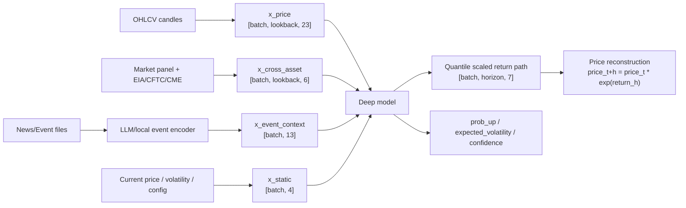
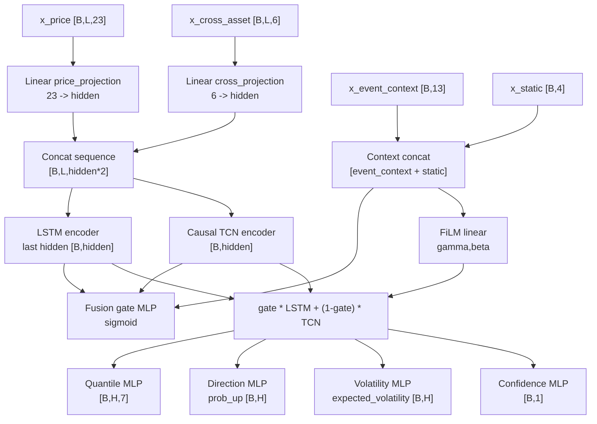
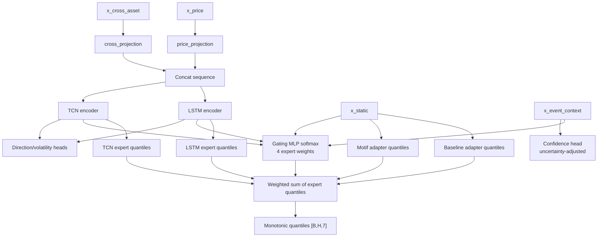

# 모델 설계

숫자 예측은 시계열 모델과 baseline이 담당합니다. LLM은 context/event encoder와 explanation generator이며 가격을 직접 예측하지 않습니다.

## 모델 분류

| 분류 | 모델 |
| --- | --- |
| Classical | `motif` |
| Deep learning | `pattern_mlp`, `deep_lstm_tcn_fusion`, `llm_context_seq_moe` |
| Baseline | `random_walk`, `drift`, `seasonal_naive`, `volatility_scaled_naive` |
| Backtest-only | `flat`, `simple_moving_average_path`, optional `regime_ensemble` |
| Removed/deprecated | `cycle`, `lstm`, `tcn`, `ensemble` |

## Forecast Target

Forecast target은 volatility-scaled cumulative log return distribution입니다. Raw future price를 직접 target으로 학습하지 않습니다.

```text
scaled_target_h = cumulative_log_return_h / recent_realized_volatility
price_t+h = current_price * exp(predicted_cumulative_log_return_h)
```

이 구조를 유지해야 자산 가격대가 달라도 같은 모델/feature 구조로 확장할 수 있습니다.

## 입력 Feature

| 입력 | 내용 |
| --- | --- |
| `x_price` | log return, vol-scaled return, range, rolling volatility, momentum, drawdown, autocorr, trend, skew/kurtosis, cycle feature |
| `x_cross_asset` | related return, correlation, spread, relative strength, risk proxy, missing indicator |
| `x_event_context` | local_rules 또는 LLM이 생성한 event/context vector |
| `x_static` | current price, realized volatility, lookback, horizon |

EIA/CFTC/CME/event context는 `feature_available_at <= as_of_time` 조건을 만족할 때만 sample에 들어갑니다.

## 입출력 Tensor 구조

현재 artifact 기준 `1d`, `horizon=8`, `lookback=128`에서 deep model 입력과 출력은 다음과 같습니다.

| Tensor | Shape | 의미 |
| --- | --- | --- |
| `x_price` | `[batch, 128, 23]` | 각 종목 자체 OHLCV에서 만든 가격/변동성/추세/분포 feature |
| `x_cross_asset` | `[batch, 128, 6]` | 관련 자산 평균 수익률, rolling correlation, EIA/CFTC/CME 파생 proxy, missing indicator |
| `x_event_context` | `[batch, 13]` | 뉴스/이벤트를 LLM 또는 local rule이 바꾼 context vector |
| `x_static` | `[batch, 4]` | 현재가, 최근 실현변동성, lookback, horizon |
| `quantiles` | `[batch, 8, 7]` | 5/10/25/50/75/90/95% volatility-scaled cumulative log return |
| `prob_up` | `[batch, 8]` | 각 horizon step의 상승 방향 확률 |
| `expected_volatility` | `[batch, 8]` | 각 step의 예상 변동성 |
| `confidence` | `[batch, 1]` | 모델 내부 confidence score |

예측 가격은 모델 출력인 scaled cumulative log return을 최근 실현변동성으로 되돌린 뒤 아래 식으로 복원합니다.

```text
predicted_cumulative_log_return_h = predicted_scaled_return_h * recent_realized_volatility
predicted_price_t+h = current_price * exp(predicted_cumulative_log_return_h)
```

현재 학습 script가 생성하는 artifact의 기본 architecture 값은 다음과 같습니다.

| 항목 | 현재 값 |
| --- | --- |
| `hidden_dim` | 48 |
| `dropout` | 0.1 |
| Quantile levels | 0.05, 0.10, 0.25, 0.50, 0.75, 0.90, 0.95 |
| LSTM | 1-layer, unidirectional `nn.LSTM(input_size=96, hidden_size=48, batch_first=True)` |
| TCN | `Linear(96 -> 48)` 후 dilation 1/2/4/8 causal residual blocks |
| TCN block | `CausalConv1d(48 -> 48, kernel=3, dilation=d)` x 2, `GELU`, `Dropout(0.1)`, residual `LayerNorm(48)` |
| 공통 MLP | `Linear(input -> 48)`, `GELU`, `Dropout(0.1)`, `Linear(48 -> output)` |

## 전체 Deep Forecast 흐름



## DeepLstmTcnFusion

`deep_lstm_tcn_fusion`은 가격 feature와 optional cross-asset feature를 projection한 뒤 causal LSTM encoder와 causal TCN encoder를 병렬로 사용합니다. Fusion gate는 LSTM/TCN representation, event context, static feature를 입력으로 받아 두 encoder를 섞습니다.



출력:

- volatility-scaled cumulative log return quantiles
- `prob_up`
- expected volatility
- confidence

레이어 구성:

| 단계 | 구성 |
| --- | --- |
| Projection | `x_price: 23 -> 48`, `x_cross_asset: 6 -> 48` |
| Sequence concat | `[B,128,48] + [B,128,48] -> [B,128,96]` |
| LSTM encoder | `[B,128,96] -> last hidden [B,48]` |
| TCN encoder | `[B,128,96] -> [B,48]`, dilation 1/2/4/8 causal residual stack |
| Context conditioning | `x_event_context [B,13] + x_static [B,4] -> context [B,17]` |
| Fusion gate | `MLP(48 + 48 + 17 -> 48)`, sigmoid 후 `gate * LSTM + (1-gate) * TCN` |
| FiLM | `Linear(17 -> 96)`을 `gamma [B,48]`, `beta [B,48]`로 나눠 fused representation 조정 |
| Heads | quantile `MLP(48 -> 56)` 후 `[B,8,7]`, direction `MLP(48 -> 8)`, volatility `MLP(48 -> 8)`, confidence `MLP(48+17 -> 1)` |

## LLMContextSeqMoE

`llm_context_seq_moe`는 LSTM expert, TCN expert, baseline adapter, motif adapter를 가진 learned mixture-of-experts입니다.



LLM/event context의 역할:

- gating network에 context 제공
- uncertainty/confidence 조정에 도움
- regime/event state를 보조 feature로 제공

LLM/event context가 하지 않는 일:

- 가격 path 직접 생성
- p50/p90 직접 생성
- 시계열 모델 output overwrite

레이어 구성:

| 단계 | 구성 |
| --- | --- |
| Shared projection | `x_price: 23 -> 48`, `x_cross_asset: 6 -> 48`, concat 후 `[B,128,96]` |
| Shared sequence encoder | LSTM last hidden `[B,48]`, TCN representation `[B,48]` |
| Expert heads | LSTM expert `MLP(48 -> 56)`, TCN expert `MLP(48 -> 56)`, baseline adapter `MLP(4 -> 56)`, motif adapter `MLP(4 -> 56)` |
| Gating network | `x_event_context [B,13] + x_static [B,4] + LSTM [B,48] + TCN [B,48] -> MLP(113 -> 4)`, softmax expert weight |
| Mixture | 4개 expert `[B,8,7]`를 softmax weight로 가중합하고 quantile monotonicity를 `sort`로 보정 |
| Auxiliary heads | direction/volatility는 `MLP(48+48+4 -> 8)`, confidence는 `MLP(13+4 -> 1)` 후 event uncertainty로 감산 |

## Framework 판단

현재 deep learning 코드는 이미 PyTorch 기반입니다.

- 모델은 `torch.nn.Module`로 구현되어 있습니다.
- LSTM은 `torch.nn.LSTM`을 사용합니다.
- 학습은 `torch.utils.data.DataLoader`, `torch.optim.AdamW`, gradient clipping을 사용합니다.
- Mac에서는 `--device mps`, NVIDIA 환경에서는 `--device cuda`로 가속할 수 있습니다.

따라서 TensorFlow/Keras로 단순 이식한다고 빨라질 가능성은 낮습니다. 현재 병목은 framework가 아니라 다음 쪽입니다.

- 뉴스/LLM event context 생성 속도와 API quota
- 짧은 뉴스 history
- walk-forward backtest에서 origin마다 deep inference dataset을 다시 만드는 비용
- baseline 대비 충분히 강한 학습 신호 부족

프레임워크 교체보다 효과가 큰 개선은 LLM context cache/resume, 장기 뉴스 데이터 확보, backtest inference cache, 더 엄격한 time split/coverage 평가입니다.

## Quantile과 Calibration

Quantile path는 monotonic해야 합니다. Rolling backtest residual로 calibration artifact를 만들 수 있습니다.

```text
artifacts/calibration/{model}_{symbol}_{interval}.json
```

Calibration artifact가 충분히 검증되기 전까지 probabilistic band는 residual-volatility adapter이며 검증된 confidence interval이 아닙니다.

## Artifact와 Metadata

- `.npz` legacy/global artifact: `artifacts/models`
- `.pt` deep artifact: `artifacts/models`
- metadata JSON: `artifacts/metadata`

Metadata에는 최소한 model id, interval, horizon, lookback, training window, train/validation loss, feature source, data hash 또는 manifest reference가 들어가야 합니다.

## 현재 학습 가능한 구성

현재 processed data로 다음 구성이 가능합니다.

```bash
.venv/bin/python scripts/train/train_deep_fusion_models.py \
  --model both \
  --interval 1d \
  --horizon 8 \
  --lookback 128 \
  --universe research_core \
  --use-processed-data \
  --market-panel data/processed/market_panel/1d/panel.csv \
  --oil-fundamentals data/processed/oil_fundamentals/eia_weekly.csv \
  --cot data/processed/oil_fundamentals/cftc_cot_weekly.csv \
  --event-context data/processed/event_context/event_context_daily.csv \
  --max-samples 512 \
  --epochs 3 \
  --batch-size 64 \
  --device mps \
  --force
```

`horizon=45`도 가능하지만, 뉴스/event context history가 짧으면 LLM context 효과는 제한적으로 해석해야 합니다.

## 제거된 모델의 이유

- `lstm`/`tcn`: live cached 학습 방식이라 artifact 기반 재현성과 운영 안정성이 낮았습니다.
- `cycle`: standalone extrapolation보다 cycle phase/strength feature로 쓰는 편이 낫습니다.
- `ensemble`: fixed-weight mix는 regime/context를 학습하지 못하므로 learned MoE로 대체했습니다.
